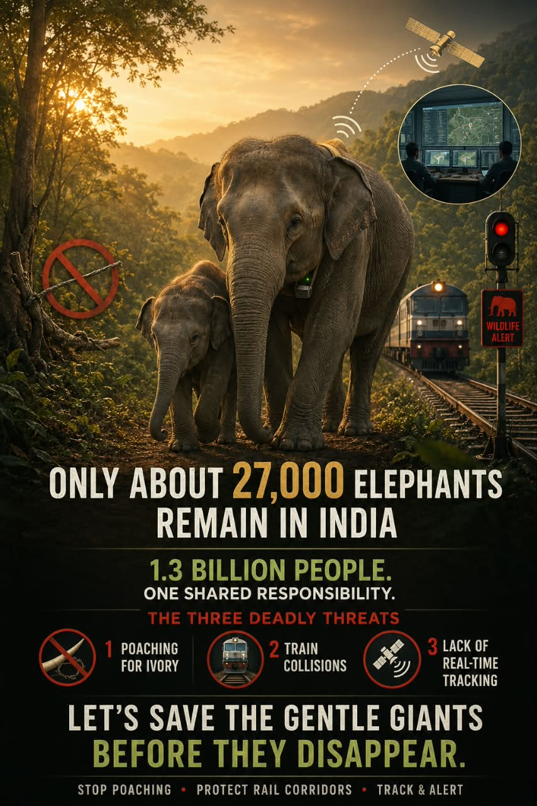
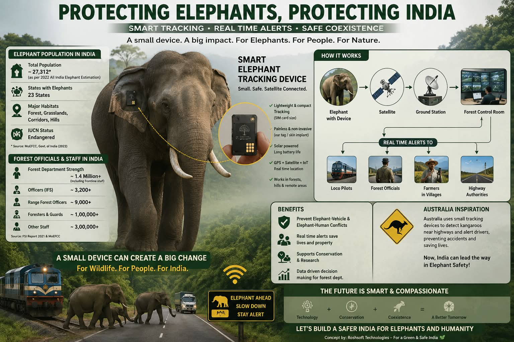
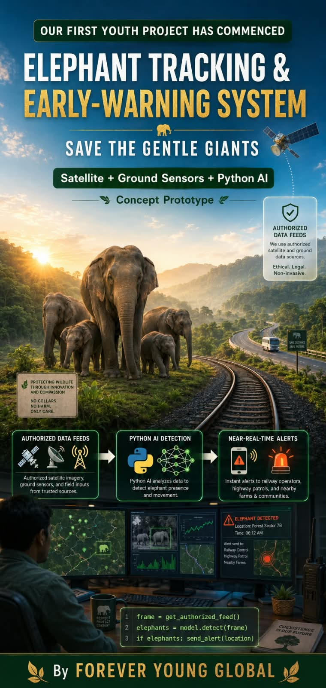
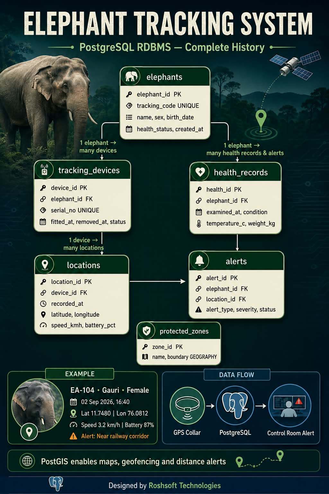
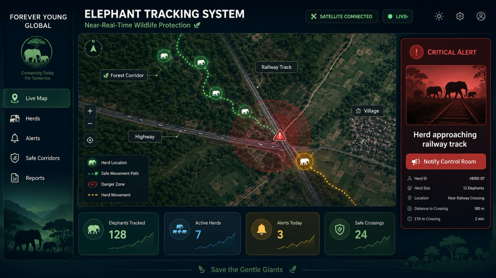
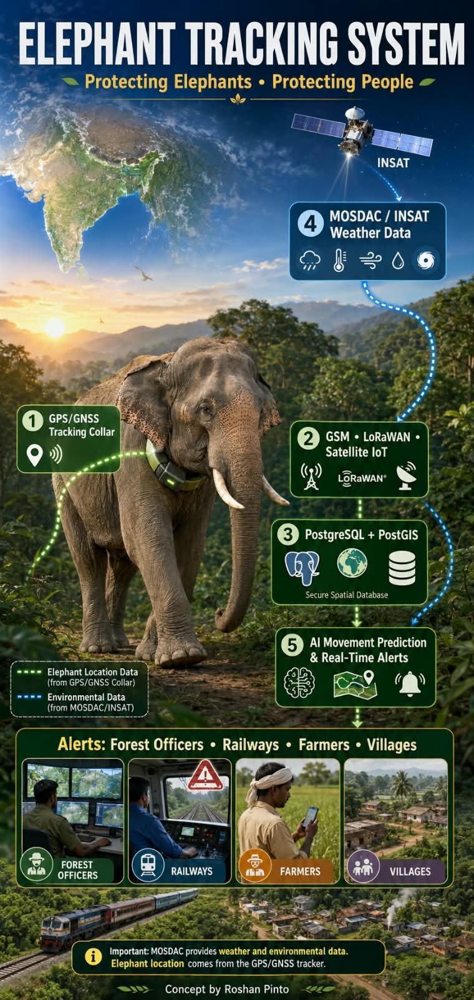

# Elephant Tracking System

Conservation-focused Python MVP by **Vyalary and Kavya**.

It receives GPS telemetry from elephant collars, stores movement history, detects entry into configurable danger zones, raises alerts, and shows an operations dashboard for authorized forest staff.

> Important: This is a software prototype, not a certified wildlife or emergency system. Test hardware, connectivity, security, geofences, and alert delivery with the Forest Department before any field deployment. Never publish precise wildlife locations.

## Features

* FastAPI REST service and interactive API documentation
* SQLite database with no separate database server required
* Device registration and API-key authentication
* GPS telemetry ingestion and validation
* Circular danger-zone geofencing using the Haversine formula
* Alerts for danger-zone entry, low battery, overspeed, and stale devices
* Live Leaflet map, device table, and alert acknowledgement
* CSV movement export
* Device simulator, automated tests, Dockerfile, and health endpoint
* Public privacy-safe summary containing counts only

## Project Screenshots

### Save Elephants



### Dashboard



### Prototype Concept



### Database Schema



### Elephant Tracking System



### How to Implement



## Quick start

Requires Python 3.11 or later.

```bash
python -m venv .venv
source .venv/bin/activate            # Windows: .venv\\Scripts\\activate
pip install -r requirements.txt
cp .env.example .env
python scripts/seed_demo.py
uvicorn app.main:app --reload
```

Open `http://127.0.0.1:8000`. The default development admin key is shown in `.env.example`; change it before any deployment.

In a second terminal, generate sample movement:

```bash
source .venv/bin/activate
python scripts/simulate_tracker.py --device-id ELE-001 --device-key demo-device-key
```

Run tests:

```bash
pytest
```

## Device request example

```bash
curl -X POST http://127.0.0.1:8000/api/v1/telemetry \
  -H 'Content-Type: application/json' \
  -H 'X-Device-Key: demo-device-key' \
  -d '{"device_id":"ELE-001","latitude":12.9141,"longitude":74.8560,"battery_percent":87,"speed_kmh":4.2,"temperature_c":31.0,"signal_strength":72}'
```

## Production checklist

* Replace all development keys and use HTTPS/TLS.
* Use one unique secret per collar and rotate compromised keys.
* Restrict the dashboard to Forest Department/Veterinary staff.
* Put the service behind a VPN or identity-aware proxy.
* Replace console alerts with an approved SMS/WhatsApp/radio gateway.
* Use PostgreSQL with encrypted backups for multi-station deployment.
* Define geofences jointly with local officials and test alert escalation.
* Retain exact coordinates only as long as operationally necessary.

## Project layout

```text
app/                 API, database, geofencing and dashboard
scripts/             demo data and tracker simulator
tests/               automated tests
data/                runtime SQLite database (created automatically)
images/              project screenshots and documentation images
```

## Authors

Vyalary and Kavya
